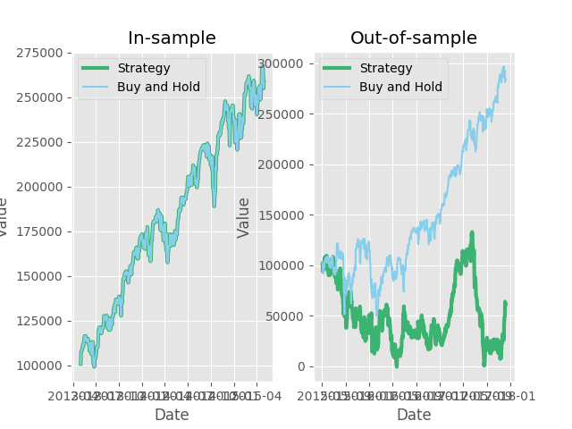

# Trading with Q-Learning

Uses [Machine_Learning_for_Trading](https://github.com/jason-r-becker/Machine_Learning_for_Trading), made to work with Python 3.6+, Metatrader 4 data - [data_server](https://github.com/quant-trade/data_server) can be used, and some improvements.

## How to run

Edit values in main.py and:

    $ python main.py

P.S. Neither original, nor this code is reproducible, for educational purposes only.
